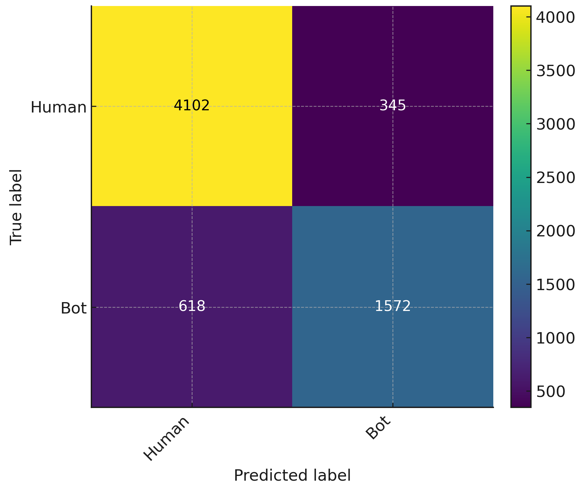

# Bot Detection Model (FastCSSTool)

## Overview
FastCSSTool embeds an account-level bot detector to improve data quality before manual labeling and model training. The detector consumes 17 metadata-derived features from the author profile and tweet record, runs efficient ONNX Runtime inference, and filters rows predicted as bots in batch.

- Dataset: Hydrated subset of the Twitter Bot Detection Dataset (n = 33,184 of 40,566 IDs)
- Selection: FLAML (macro-F1 objective) chose XGBoost
- Export: Trained classifier exported to ONNX and bundled with the tool
- Inference: Multicore ONNX Runtime

## Feature Set (17)
| Feature | Description |
|---|---|
| Account age | Time elapsed since account creation (days) |
| Statuses count | Total number of tweets posted by the account |
| Followers | Total number of followers |
| Following (friends) | Total number of accounts followed |
| Listed count | Number of public lists the account appears in |
| Posting frequency | Tweets per unit time over account age |
| Follower growth rate | Change in followers over time (approximate) |
| Following growth rate | Change in following over time (approximate) |
| Follower/following ratio | Ratio of followers to following |
| Tweet/follower ratio | Ratio of statuses to followers |
| Screen-name length | Character length of the screen name |
| Display-name length | Character length of the display name |
| Digits in screen/display names | Count of numeric characters in names |
| URL in profile description | Binary indicator of URL presence |
| Location provided | Binary indicator of location field presence |
| Account creation hour | Integer hour (0–24) of account creation |
| Network proxy | log(1+statuses) × log(1+followers) |

## Training & Model Selection
- Models were tuned on the training split and evaluated on the held-out test set using scikit-learn.
- FLAML selected an XGBoost classifier with the following settings (best trial):
  - learning_rate = 0.136
  - gamma (min split loss) = 0.350
  - max_depth = 9
  - n_estimators = 109
  - min_child_weight = 2
  - eval_metric = auc

## Performance
| Class | Precision | Recall | F1-score |
|---|---:|---:|---:|
| Human | 0.87 | 0.92 | 0.89 |
| Bot | 0.82 | 0.72 | 0.77 |
| Accuracy | | | 0.85 |
| Macro avg | 0.84 | 0.82 | 0.83 |
| Weighted avg | 0.85 | 0.85 | 0.85 |

  
   
  Rows: true labels; columns: predicted labels. Correctly identifies 4,102 humans and 1,572 bots; 345 humans misclassified as bots (FP) and 618 bots misclassified as humans (FN). Overall accuracy: 0.85.

## Integration in FastCSSTool
- Location: Data Preprocessing page → Filter Bots
- Usage: Select Filter Bots and specify the positive label ("bot") to remove.
- Execution: Tool computes the 17 features in batch, runs multicore ONNX Runtime inference, and removes rows predicted as bots.
- Output: A summary dialog reports filtered vs. retained rows.

## Reproducibility Notes
- Implementation uses scikit-learn for preprocessing and validation, FLAML for estimator search, and XGBoost for the final model.
- The shipped model is frozen and exported in ONNX format to ensure portable inference without training dependencies.
